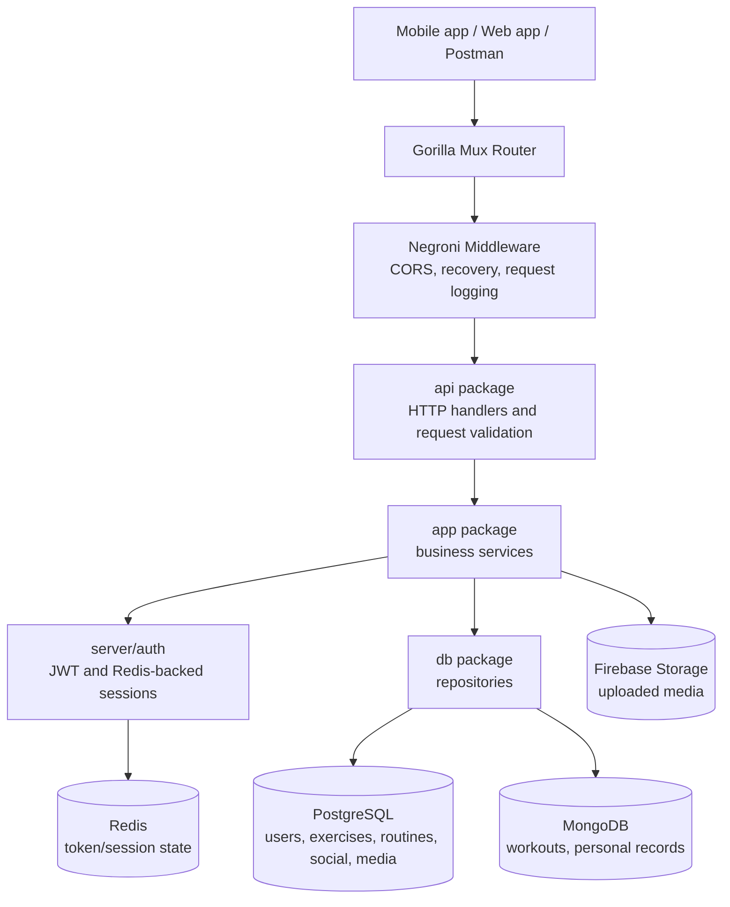

# GymBud

GymBud is a backend API for a social workout tracking app. It helps users create workout routines, log completed workouts, track personal records, store body metrics, and follow other users for a lightweight fitness feed.

The project is written in Go and exposes a REST API backed by PostgreSQL, MongoDB, Redis, and Firebase Storage.

## Features

- JWT based signup, login, logout, and authenticated API access.
- User profiles with privacy, activity status, profile images, and body metrics.
- Exercise catalog with admin-created and user-created exercises.
- Routine builder with ordered exercises, target sets, rep ranges, and target weights.
- Workout logging with duration, visibility, notes, exercise performance, stats, and personal records.
- Social graph with follow requests, private profile handling, following feeds, and workout likes.
- Media upload support through Firebase Storage.
- Workout analytics for the current user and other visible users.
- Request logging, CORS, validation, graceful shutdown, and centralized configuration.

## Architecture



## Project Structure

- `cmd/api`: application entrypoint.
- `server`: server bootstrap, config loading, database clients, auth, middleware, logger, and validator setup.
- `api`: route registration, HTTP handlers, request parsing, and response formatting.
- `app`: application services and business workflows.
- `model`: domain models and repository interfaces.
- `db/postgres`: PostgreSQL repositories and table initialization.
- `db/mongo`: MongoDB repositories for workout documents and personal records.
- `schema`: request/response schema types.
- `conf`: local configuration files. Use `conf/sample.toml` as the configuration reference.

## Setup

1. Install Go `1.25.0` or newer.
2. Start the required services:
   - PostgreSQL
   - MongoDB
   - Redis
   - Firebase project with Storage enabled
3. Create a local configuration file:

```powershell
Copy-Item conf/sample.toml conf/default.toml
```

4. Fill in the values in `conf/default.toml`.
5. Download dependencies:

```powershell
go mod download
```

6. Run the API:

```powershell
go run ./cmd/api
```

By default, the API listens on the host and port configured in `conf/default.toml`.

## Environment Variables

GymBud is configured through TOML config rather than scattered environment variables. Redirect to `conf/sample.toml` for the full list of required config keys, example values, and service-specific settings.

Important config groups:

- `server`: listen address, port, environment, CORS, and timeouts.
- `tokenAuth`: JWT secret, issuer, and expiration.
- `postgres`: PostgreSQL connection and pool settings.
- `mongoDB`: MongoDB URI, database name, and connect timeout.
- `redis`: Redis address, password, DB index, and timeouts.
- `firebase`: Firebase service account and storage bucket settings.
- `additional`: app-level constants such as workout pagination and exercise metadata.

Do not commit real secrets, private keys, production database credentials, or Firebase service account keys.

## API

[List of all the APIs.](https://documenter.getpostman.com/view/53826364/2sBXqKnKXu)

The API is served from `/v1/api`.

## Database Schema

GymBud uses PostgreSQL for relational account, routine, exercise, social, and media data. MongoDB stores workout logs because those documents contain nested exercise and set performance data.

### PostgreSQL

| Table | Purpose |
| --- | --- |
| `users` | Core account and profile data. |
| `user_body_metrics` | Historical height and weight entries. |
| `user_current_stats` | Latest derived body stats such as BMI. |
| `exercises` | Exercise catalog, including global/admin exercises and user-created exercises. |
| `routines` | User routine headers. |
| `routine_exercises` | Ordered exercises inside a routine. |
| `routine_exercise_sets` | Target set details for each routine exercise. |
| `follows` | Follower/followee relationships and request status. |
| `workout_likes` | Users who liked a workout. |
| `media` | Uploaded media metadata and public URLs. |

### MongoDB

| Collection | Purpose |
| --- | --- |
| `workouts` | Completed workout documents with routine ID, timing, visibility, notes, performed exercises, and aggregate stats. |
| `personal_records` | Latest/best exercise records generated from workout performance. |

The application initializes its PostgreSQL tables from repository startup code. Keep schema changes aligned with the repository models and request/response schemas.
